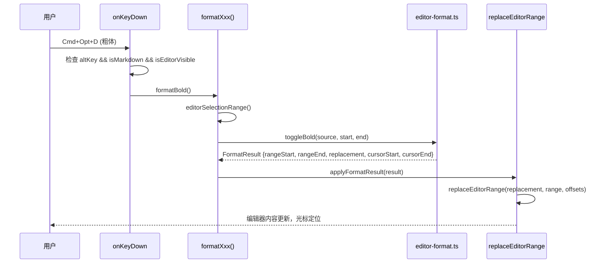

# Editor 快捷键与格式化工具栏

## 问题

编辑 Markdown 时缺少快速格式化手段，用户需要手动输入 `#`、`**`、`>` 等标记符号，影响编辑效率。

## 影响

- 无法在编辑过程中快速调整标题级别
- 无法快速切换粗体、斜体、引用等格式
- 缺少有序/无序列表的快速切换
- 工具栏只有"插入"操作，缺少"切换"（toggle）操作

## 解决核心思路

1. **纯函数分层**：将所有文本格式化逻辑抽取为纯函数模块 `editor-format.ts`，与 UI 层解耦
2. **统一接口**：所有格式化函数返回 `FormatResult`，通过单一的 `applyFormatResult` 桥接到编辑器
3. **快捷键 + 工具栏双入口**：每个操作都同时支持键盘快捷键和工具栏按钮

## 快捷键表

> Mac 用 `Cmd`，Windows/Linux 用 `Ctrl`；Mac 用 `Opt`，Windows/Linux 用 `Alt`

| 快捷键 | 操作 | 助记 |
|--------|------|------|
| `Cmd+Opt+1` | 设为 H1 标题 | 1 = 一级标题 |
| `Cmd+Opt+2` | 设为 H2 标题 | 2 = 二级标题 |
| `Cmd+Opt+3` | 设为 H3 标题 | 3 = 三级标题 |
| `Cmd+Opt+4` | 设为 H4 标题 | 4 = 四级标题 |
| `Cmd+Opt+0` | 恢复为正文 | 0 = 无标题 |
| `Cmd+Opt+Shift+D` | 切换粗体 | **D**ouble asterisk（避开 macOS `Cmd+Opt+D` 系统快捷键） |
| `Cmd+I` | 切换斜体 | **I**talic（标准快捷键） |
| `Cmd+Opt+Q` | 切换引用块 | **Q**uote |
| `Cmd+Opt+Shift+C` | 包裹代码 | 单行 `` ` `` / 跨行 ` ``` ` 自动区分 |
| `Cmd+Opt+O` | 切换有序列表 | **O**rdered |
| `Cmd+Opt+L` | 切换无序列表 | **L**ist |

- **包裹代码**：`Cmd+Opt+Shift+C`（工具栏 `</>` 按钮）
- **插入代码块模板**：`Cmd+Opt+C`（Electron 菜单 / 工具栏 `+` 按钮）

### 快捷键设计原则

- **不与现有快捷键冲突**：`Cmd+B` 已被书签管理占用，`Cmd+E` 已被模式切换占用
- **`Cmd+Opt+` 前缀统一**：格式化操作使用 `Cmd+Opt+` 组合，便于记忆
- **仅在编辑器可见 + Markdown 文档时生效**：阅读模式和非 Markdown 文档不触发

### 已知限制

- Windows 下 `Ctrl+Alt` 等同于 `AltGr`，德语等键盘布局中 `AltGr+Q` 对应 `@` 字符，可能产生冲突

## 关键文件

| 文件 | 职责 |
|------|------|
| `src/renderer/lib/editor-format.ts` | 纯函数：所有格式化逻辑 |
| `tests/editor-format.test.ts` | 56 个单元测试覆盖所有格式化函数 |
| `src/renderer/App.vue` | 集成：快捷键绑定 + 工具栏 + `applyFormatResult` 桥接 |
| `tests/App.test.ts` | 集成测试：快捷键、工具栏、防守条件 |
| `src/renderer/env.d.ts` | `AppMenuCommand` 类型扩展 |
| `src/renderer/styles.less` | `.heading-select` 样式 |

## 架构设计

### 分层

```
┌─────────────────────────────────────────────┐
│  App.vue (集成层)                            │
│  ┌─────────────┐  ┌─────────────────────┐   │
│  │ onKeyDown   │  │ format-toolbar 模板  │   │
│  │ 快捷键路由   │  │ 按钮 + select       │   │
│  └──────┬──────┘  └──────────┬──────────┘   │
│         │                    │               │
│         ▼                    ▼               │
│  ┌──────────────────────────────────────┐    │
│  │ formatBold / formatItalic / ...      │    │
│  │ 薄包装：读选区 → 调纯函数 → 应用结果  │    │
│  └──────────────────┬───────────────────┘    │
│                     ▼                        │
│  ┌──────────────────────────────────────┐    │
│  │ applyFormatResult(result)            │    │
│  │ → replaceEditorRange(...)            │    │
│  └──────────────────────────────────────┘    │
└─────────────────────────────────────────────┘

┌─────────────────────────────────────────────┐
│  editor-format.ts (纯函数层)                 │
│                                             │
│  setLineHeading()   toggleBold()            │
│  toggleItalic()     toggleQuote()           │
│  toggleCodeBlock()  toggleOrderedList()     │
│  toggleUnorderedList()                      │
│                                             │
│  内部复用:                                   │
│  ├── toggleInlineMarker() ← bold, italic    │
│  ├── toggleLinePrefix()  ← quote, OL, UL   │
│  ├── lineRangeAt()       ← heading          │
│  └── expandToFullLines() ← line-level ops   │
└─────────────────────────────────────────────┘
```

### 数据流



### FormatResult 接口

```typescript
interface FormatResult {
  rangeStart: number;   // 原文替换起点
  rangeEnd: number;     // 原文替换终点
  replacement: string;  // 替换内容
  cursorStart: number;  // 光标起点（相对 rangeStart 的偏移）
  cursorEnd: number;    // 光标终点（相对 rangeStart 的偏移）
}
```

## 工具栏按钮

工具栏按钮位于 `format-toolbar > format-actions`，仅在 Markdown 文档中显示：

| testid | 图标 | 操作 |
|--------|------|------|
| `heading-select` | 下拉选择 | 正文/H1/H2/H3/H4 |
| `format-bold` | **B** | 切换粗体 |
| `format-italic` | *I* | 切换斜体 |
| `format-quote` | 引用线 | 切换引用块 |
| `format-code` | `</>` | 切换代码块 |
| `format-ordered-list` | 1. 2. 3. | 切换有序列表 |
| `format-unordered-list` | - - - | 切换无序列表 |

## 格式化行为说明

### 标题（setLineHeading）
- 操作光标所在行
- 替换已有的 `# ` 前缀为新级别的前缀
- `#NoSpace` 不被视为标题（需要 `# ` 后有空格）

### 粗体 / 斜体（toggleInlineMarker）
- 有选中文本 → 添加或移除 `**` / `*` 包裹
- 选中文本已含标记 → 移除标记（toggle）
- 无选中文本 → 插入占位符 `**粗体文本**` / `*斜体文本*`

### 引用 / 有序列表 / 无序列表（toggleLinePrefix）
- 操作选区覆盖的所有行
- 所有非空行已有前缀 → 移除前缀（toggle off）
- 部分或全部行无前缀 → 添加前缀（toggle on）
- 空行不受影响

### 代码块（toggleCodeBlock）
- 选中文本被 `` ``` `` 包裹 → 移除围栏
- 无选中文本 → 插入 `` ```\n代码\n``` ``
- 支持带语言标识的围栏（如 `` ```js ``）的移除

## 测试覆盖

| 测试文件 | 用例数 | 覆盖范围 |
|----------|--------|----------|
| `tests/editor-format.test.ts` | 56 | 所有纯函数的正常 / 边界 / toggle 场景 |
| `tests/App.test.ts` (新增部分) | 9 | 工具栏点击、快捷键触发、防守条件、zoom 隔离 |
