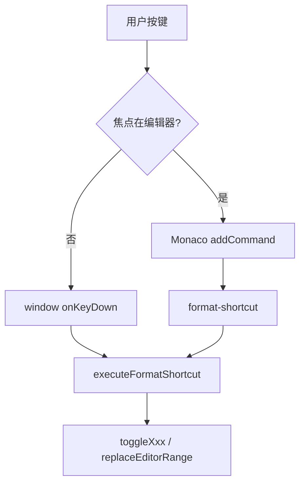

# Editor Shortcut Enhancement - Mac Alt 键兼容修复

## 问题

### 问题 1：Alt 快捷键在 Mac 上完全无效

**现象**: 用户按下 `Cmd+Opt+D`（粗体）、`Cmd+Opt+Q`（引用）等快捷键后无任何反应。

**根因**: Mac 上 `Option/Alt` 修饰符会改变 `event.key` 的值为特殊字符。

原代码用 `event.key.toLowerCase()` 匹配字母/数字，在 Mac 上永远匹配不到。

### 问题 2：快捷键冲突排查

`Cmd+Alt+Shift+B` 用于 Electron 菜单的 `toggle-toc-panel`（展开/收起目录侧栏），因此 `Cmd+Alt+B` 可以留给粗体。

### 问题 3：双重 Tooltip

CSS `aria-label` tooltip 与浏览器 `title` tooltip 重复显示。

### 问题 4：Monaco 双触发

window 与 Monaco 各执行一次 toggle，视觉上无变化。

### 问题 5：代码块快捷键混淆

插入模板 `Cmd+Opt+C` vs 包裹 toggle 原无快捷键。

### 问题 6：快捷键前缀与语义不统一

**现象**: 格式化快捷键有的使用 `Cmd+I`，有的使用 `Cmd+Opt`，粗体后缀还是 `D`，不便于记忆。

**调整**: 格式化快捷键统一使用 `Cmd+Opt+` 前缀，后缀使用语义首字母；粗体使用 `B`，斜体使用 `I`，无序列表使用 `U`。

**兼容**: 目录侧栏改为 `Cmd+Opt+Shift+B`，避免和粗体 `Cmd+Opt+B` 冲突。

## 当前快捷键表

| 快捷键 | 操作 |
|--------|------|
| `Cmd+Opt+B` | 粗体 |
| `Cmd+Opt+I` | 斜体 |
| `Cmd+Opt+Shift+C` | 包裹代码（单行 `` ` `` / 跨行 ` ``` `） |
| `Cmd+Opt+C` | 插入代码块模板 |
| `Cmd+Opt+Q` | 引用 |
| `Cmd+Opt+U` / `O` | 无序 / 有序列表 |
| `Cmd+Opt+0~4` | 标题级别 |

## 解决思路

1. `event.code` 匹配 Alt 组合键
2. 编辑器聚焦时委托 Monaco `addCommand`，避免双触发
3. `toggleCodeBlock()` 按选区是否含 `\n` 区分行内 / 围栏
4. 格式化操作统一使用 `Cmd+Opt+` 前缀，后缀使用语义首字母；目录侧栏使用 `Cmd+Opt+Shift+B`

## 日志排查

过滤 `formatShortcut`（现已写入 `~/Library/Application Support/Markdown 纪/markdown-editor-debug.log`）：

| 事件 | 含义 |
|------|------|
| `renderer.formatShortcut.execute` | 成功执行 |
| `renderer.formatShortcut.skipped` | 跳过（非 Markdown / 编辑器隐藏） |
| `renderer.formatShortcut.delegated` | window 层委托给 Monaco 处理 |

若按键后日志完全无 `formatShortcut` 记录，说明按键未进入应用（系统快捷键拦截）或 Monaco 未收到事件。

### 2026-07-01 修复：Monaco 内快捷键未触发

**现象**: `Cmd+Opt+Shift+C` 无反应，日志无 `formatShortcut`。

**根因**: 编辑器聚焦时 window 层会 `delegated` 给 Monaco，但原先依赖 `addCommand` + DOM `keydown`；Monaco 实际通过 `onKeyDown` 处理按键，DOM 路径不可靠。

**修复**: 在 `onMonacoKeyDown` 中解析并触发 `format-shortcut`，移除重复的 `addCommand` 注册。

## 关键文件

| 文件 | 职责 |
|------|------|
| `src/renderer/lib/editor-shortcut.ts` | 快捷键解析 |
| `src/renderer/lib/editor-format.ts` | 格式化纯函数 |
| `src/renderer/components/MarkdownMonacoEditor.vue` | Monaco 命令注册 |
| `src/renderer/App.vue` | 路由与 UI |

## 数据流


