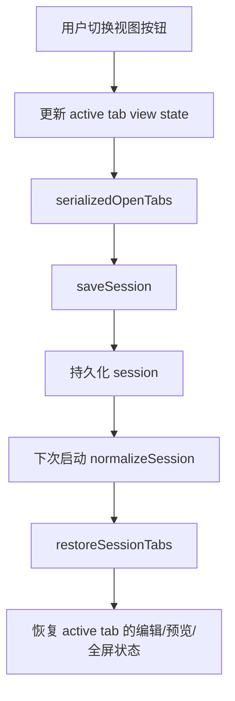
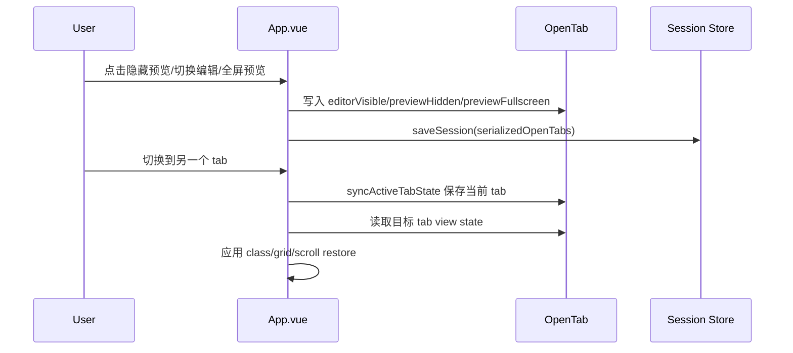
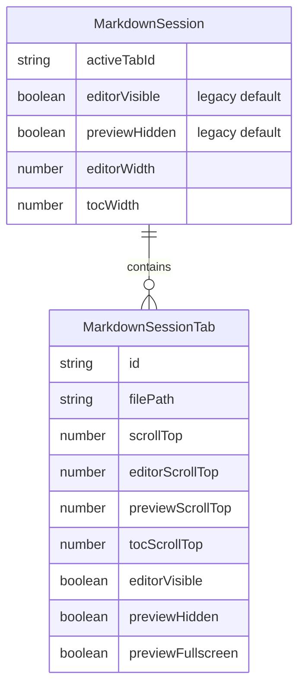
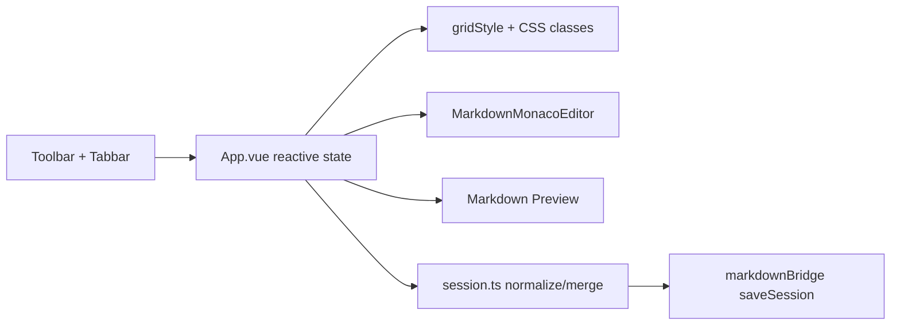

# 修复滚动区域、编辑器状态栏与标签页视图隔离

## 问题

编辑区和预览区的可滚动区域没有被完整约束在窗口可视高度内，底部内容在某些窗口尺寸下会被裁掉，滚动条也无法滚到真实内容末尾。同时，编辑器缺少底部状态信息，无法直接看到文档总行数和光标位置。

另一个问题是视图状态使用全局 session 字段保存。`editorVisible`、`previewHidden` 和预览全屏状态会在不同 tab 之间互相影响，导致一个文件切到纯编辑、纯预览或全屏预览后，再切换到另一个文件时视图模式被覆盖。

## 影响

- 长文档底部内容可能不可见，编辑和预览都受影响。
- 用户无法从编辑器底部确认当前光标行列和总行数。
- 多 tab 场景下，视图模式不是文件级状态，来回切换时不符合预期。
- 老 session 中已有 tab 但没有新视图字段时，升级后需要保持原有全局视图偏好。

## 核心思路

1. 把编辑区布局改为三行：工具栏、可滚动编辑器、底部状态栏。
2. 给 app shell 和 workspace 增加明确的视口高度约束，让滚动发生在编辑器和预览自身，而不是被外层裁掉。
3. 将 `editorVisible`、`previewHidden`、`previewFullscreen` 保存到每个 tab，切换 tab 时恢复该 tab 自己的视图状态。
4. 保留顶层 session 的视图字段作为兼容默认值，老数据归一化时用它们填充旧 tab。
5. 补充单元测试覆盖：tab 视图隔离、编辑器状态栏、session schema 归一化和老 session 兼容。

## 关键文件

- `src/renderer/App.vue`
  - active tab 视图状态计算与持久化。
  - 编辑器状态栏文案。
  - 预览全屏切换改为 per-tab 状态。
- `src/renderer/lib/session.ts`
  - `MarkdownSessionTab` 增加 `editorVisible`、`previewHidden`、`previewFullscreen`。
  - `normalizeSessionTabs` 支持老 session 默认值。
- `src/renderer/styles.less`
  - 固定 app/workspace 高度边界。
  - 编辑器 panel 增加底部状态栏 grid 行。
- `tests/App.test.ts`
  - 覆盖 tab 视图状态隔离和编辑器状态栏。
- `tests/session.test.ts`
  - 覆盖 tab 视图字段归一化和旧 session 兼容。

## 数据流

## 调用时序

## 数据关系

## 架构

## 使用方法

- 每个 tab 可以独立保持以下模式：
  - 纯编辑：显示编辑器，隐藏预览。
  - 纯预览：隐藏编辑器，显示预览。
  - 编辑 + 预览：两栏同时显示。
  - 预览全屏：当前 tab 单独进入全屏预览。
- 在编辑器底部状态栏查看：
  - `共 N 行`
  - `第 X 行，第 Y 列`
- 老 session 自动兼容，不需要手动迁移。

## 验证

- `pnpm test`
  - 5 个测试文件通过。
  - 125 个测试通过。
- `pnpm lint`
  - `vue-tsc --noEmit` 通过。
- `pnpm build`
  - Vite 生产构建和 Electron 主进程编译通过。
- `pnpm build:mac`
  - 生成 `release/Markdown 纪-0.1.9-arm64.dmg`。
- `pnpm build:win_x64`
  - 生成 `release/Markdown 纪-0.1.9-win-x64-setup.exe`。

## Review 记录

连续 3 轮自查后的调整：

1. 清理临时空文件，整理测试缩进，并避免新打开 tab 继承当前 tab 的全屏预览状态。
2. 修复 `editorVisible` 的布尔 OR 边界，确保 active tab 明确为纯预览时不会被全局 session 覆盖。
3. 增加旧 session 兼容：老 tab 没有 per-tab 视图字段时，继承旧的全局 `editorVisible` 和 `previewHidden`。

## 剩余风险

- HTML iframe 预览的内部滚动仍由 iframe 页面自身负责，本次只约束宿主 iframe 区域。
- Electron 真机窗口标题栏高度差异需通过后续人工或 Playwright Electron 视觉测试继续观察。
