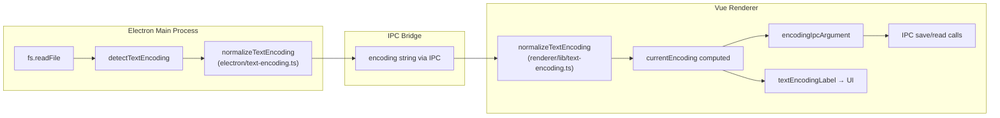
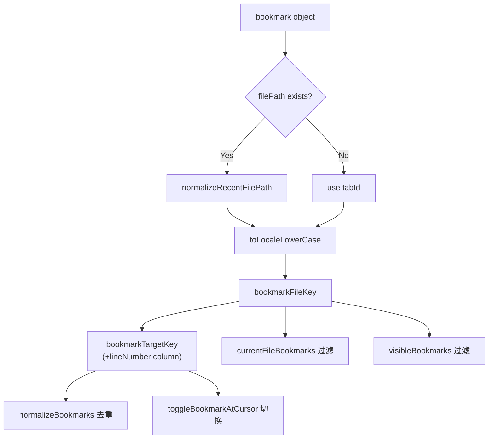
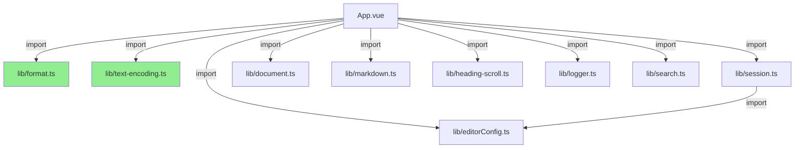

# 优化 2：DRY 原则整治与编码归一化 Bug 修复

## 问题分析

### 问题 1：App.vue 中嵌入大量可复用纯函数（违反 DRY / 单一职责）

**现象**：`App.vue`（6,100+ 行）中内联定义了多个纯函数和类型，这些逻辑与 UI 状态无关，应当提取为独立模块以提升复用性和可测试性。

**影响**：
- 无法在其他组件中复用这些函数
- 无法独立测试这些函数（需要挂载整个 App 组件）
- App.vue 职责过重，维护困难

**涉及的重复定义**：

| 函数/类型 | 原位置 | 重复出现 |
|---|---|---|
| `TextEncoding` 类型 | App.vue:195 | electron/text-encoding.ts:3 |
| `normalizeTextEncoding` | App.vue:708 | electron/text-encoding.ts:28 |
| `textEncodingLabel` | App.vue:715 | 仅 App.vue |
| `encodingIpcArgument` | App.vue:720 | 仅 App.vue |
| `formatFileSize` | App.vue:780 | 仅 App.vue |
| `formatFileModifiedTime` | App.vue:798 | 仅 App.vue |
| `bookmarkFileKey` | App.vue:817 | 逻辑等价于 session.ts recentFileKey |
| `bookmarkTargetKey` | App.vue:828 | session.ts:269, electron/main.ts:526 |

### 问题 2：`normalizeTextEncoding` 对 `shift_jis` 编码的归一化 Bug

**现象**：`normalizeTextEncoding('shift_jis')` 返回 `'utf8'` 而非期望的 `'shift_jis'`。

**根因**：
```
输入: 'shift_jis'
↓ replace(/_/g, '-')
中间结果: 'shift-jis'
↓ options 中查找 value === 'shift-jis'
↓ 未找到（options 中的值是 'shift_jis'）
↓ 返回默认值 'utf8'  ← Bug
```

**影响**：
- 用户从下拉框选择 Shift_JIS 编码后，保存到 session → 读取回来会被重置为 UTF-8
- Electron 主进程自动检测到 Shift_JIS 编码的文件，传给渲染器后被归一化为 UTF-8

**波及范围**：`electron/text-encoding.ts` 和 `App.vue` 中的两份 `normalizeTextEncoding` 均存在此 bug。

## 解决方案

### 核心思路

1. **提取纯函数到独立模块**：将 App.vue 中与 UI 无关的纯函数提取到 `lib/` 下的独立文件
2. **统一书签键计算**：将 `bookmarkFileKey` 和 `bookmarkTargetKey` 收敛到 `session.ts`
3. **修复编码归一化 bug**：在比较编码选项时，对选项值也进行同样的下划线→连字符归一化

### 关键原则

- **最小改动**：只移动/删除代码，不改变任何业务逻辑（除 bug 修复）
- **TDD**：先写测试，再实现/提取
- **向后兼容**：所有导出的函数签名和行为保持一致

## 关键文件变更

### 新增文件

| 文件 | 用途 | 行数 |
|---|---|---|
| `src/renderer/lib/format.ts` | 文件大小/修改时间格式化 | 33 |
| `src/renderer/lib/text-encoding.ts` | 渲染器端编码类型/归一化/标签 | 57 |
| `tests/format.test.ts` | format.ts 单元测试 | 77 |
| `tests/renderer-text-encoding.test.ts` | renderer text-encoding 单元测试 | 123 |

### 修改文件

| 文件 | 变更内容 |
|---|---|
| `src/renderer/App.vue` | 删除 6 个函数和 1 个类型定义（~80 行），改为 import |
| `src/renderer/lib/session.ts` | 新增导出 `bookmarkFileKey`、`bookmarkTargetKey` |
| `electron/text-encoding.ts` | 修复 shift_jis 归一化 bug |
| `tests/session.test.ts` | 新增 bookmarkFileKey/bookmarkTargetKey 测试 |
| `tests/text-encoding.test.ts` | 新增 normalizeTextEncoding 测试覆盖 |

## 数据流动

### 编码归一化流程



### 书签键计算流程



### 模块依赖关系



绿色模块为本次新增。

## 测试覆盖

| 测试文件 | 测试数 | 覆盖内容 |
|---|---|---|
| `tests/format.test.ts` | 16 | formatFileSize 边界值、formatFileModifiedTime 各输入类型 |
| `tests/renderer-text-encoding.test.ts` | 19 | 所有编码变体归一化、标签、IPC 参数 |
| `tests/text-encoding.test.ts` | +7 | electron 端 normalizeTextEncoding 含 shift_jis 修复验证 |
| `tests/session.test.ts` | +6 | bookmarkFileKey 路径归一化、bookmarkTargetKey 组合键 |

**总计**：259 测试全部通过（原 210 + 新增 49）

## 架构备注：跨进程重复

以下逻辑在 `electron/main.ts` 和 `src/renderer/lib/session.ts` 中各有一份：

- `normalizeBookmarks`
- `normalizeRecentFilePath`（主进程用 `path.resolve`，渲染器用 URL API）
- `normalizeSessionTabs`
- `bookmarkTargetKey`
- `recentFileKey` / `tabIdForPath` / `normalizeScrollTop`

这是 Electron 架构的固有限制：主进程（Node.js/CommonJS）和渲染器进程（浏览器/ESM）无法直接共享运行时代码。主进程使用 Node.js `path` 模块，渲染器使用浏览器 API。

**类型定义**也存在三处重复：`env.d.ts`（Bridge API 契约）、`session.ts`（渲染器内部类型）、`main.ts`（主进程内部类型）。这在当前架构下是合理的分层，`env.d.ts` 作为 IPC 边界的类型契约。

未来如果需要进一步消除跨进程重复，可以考虑创建 `shared/types.ts` 并在两个 tsconfig 中包含它。
