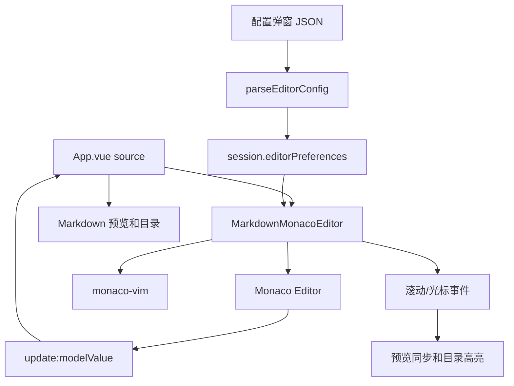
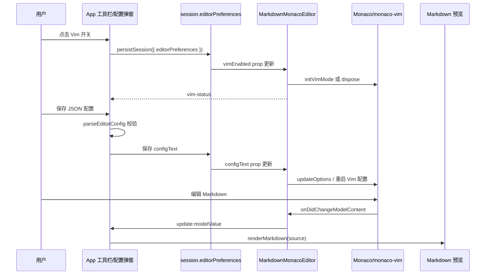
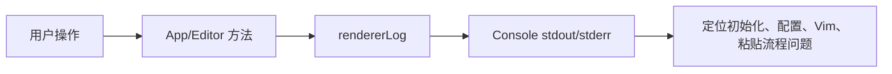

# 替换 Monaco 编辑器并支持 Vim 配置

## 规划

目标是把原来的 `textarea` 编辑区替换为 Monaco Editor，并在不破坏现有 Markdown 编辑、预览、滚动同步、图片粘贴、主题切换和会话恢复的前提下，支持 Vim 模式与自定义 JSON 配置。

实施顺序采用 TDD：

1. 先补测试，锁定会话偏好、Vim 开关、配置弹窗、非法 JSON 拦截和合法 JSON 持久化。
2. 新增独立配置解析层，避免 App 直接处理 JSON 细节。
3. 新增 Monaco 编辑器组件，向 App 暴露和原 `textarea` 等价的焦点、选区、滚动接口。
4. App 只依赖编辑器句柄，不直接绑定具体实现。
5. 跑单元测试、类型检查、生产构建和 Electron smoke。
6. 复审并优化自定义 Vim keymap 的重复注册问题。

## 设计

核心设计是把编辑器实现隔离到 `MarkdownMonacoEditor.vue`。App 仍然维护 `source`、文件状态、预览 HTML、目录和图片资源；编辑器组件只负责把 Monaco 的内容、选区、滚动、粘贴事件转换为 App 已有的数据流。



### 文件职责

- `src/renderer/components/MarkdownMonacoEditor.vue`：Monaco 初始化、主题同步、Vim 启停、编辑器事件适配。
- `src/renderer/lib/editorConfig.ts`：默认配置、会话偏好规范化、JSON 配置解析。
- `src/renderer/lib/logger.ts`：渲染端结构化日志。
- `src/renderer/lib/session.ts`：持久化 `editorPreferences`，并兼容旧会话缺字段的情况。
- `src/renderer/App.vue`：增加 Vim 开关、配置弹窗、日志落点，并继续驱动预览和文件操作。

## 使用方法

工具栏新增两个图标按钮：

- Vim 开关：点击后切换 `session.editorPreferences.vimEnabled`，状态栏会显示 `Vim 模式已开启/关闭`。
- 编辑器配置：打开 Monaco / Vim JSON 配置弹窗。

默认配置如下：

```json
{
  "tabSize": 2,
  "wordWrap": "on",
  "minimap": false
}
```

可配置字段：

```json
{
  "fontSize": 14,
  "insertSpaces": true,
  "lineNumbers": "on",
  "minimap": false,
  "tabSize": 2,
  "wordWrap": "on",
  "vim": {
    "leader": "\\",
    "keymaps": [
      { "before": "jj", "after": "<Esc>", "mode": "insert" }
    ]
  }
}
```

配置保存前会先解析 JSON。非法 JSON 不会写入会话，并会在界面状态和日志中提示 `编辑器配置不是合法 JSON`。

## 核心代码说明

`MarkdownMonacoEditor.vue` 在生产环境动态加载 `monaco-editor/esm/vs/editor/editor.api.js`，测试环境保留兼容 textarea，用于稳定验证 App 既有行为。组件通过 `defineExpose` 暴露：

- `focus()`
- `getElement()`
- `getScrollTop()` / `setScrollTop()`
- `getSelectionRange()` / `setSelectionRange()`

App 的插入表格、插入链接、粘贴图片、查找替换、滚动同步都通过这些接口工作，因此不再依赖具体 DOM 是 textarea 还是 Monaco。

Vim 模式由 `monaco-vim` 的 `initVimMode` 启动。保存新配置后，如果 Vim 已开启，会重新启动 Vim 适配层，并在注册自定义 keymap 前执行 `mapclear()`，避免重复保存配置导致映射叠加。

## 核心数据流



## 日志说明

渲染端日志通过 `rendererLog` 输出结构化对象，日志格式包含 `app`、`level`、`event`、`payload`、`timestamp`。运行 Electron 时可在开发者工具控制台看到，测试中也会出现在 stdout/stderr。

关键事件：

- `editor.monaco.init.start`：Monaco 初始化开始，记录主题和 Vim 开关状态。
- `editor.monaco.init.done`：Monaco 初始化完成，记录行数。
- `editor.monaco.config.applied`：配置已应用到 Monaco。
- `editor.config.invalid`：配置 JSON 非法。
- `editor.config.fallback`：持久化配置不可解析时回退默认配置。
- `editor.vim.enabled` / `editor.vim.disabled`：Vim 启停。
- `editor.preferences.persisted`：编辑器偏好已保存。
- `editor.paste.image.detected` / `editor.paste.image.converted`：图片粘贴处理过程。
- `app.theme.changed`：主题切换。



## 验证结果

- `pnpm test`：75 个 Vitest 测试通过。
- `pnpm lint`：`vue-tsc --noEmit` 通过。
- `pnpm build`：生产构建和 Electron TypeScript 构建通过。
- `pnpm test:electron`：4 个 Electron smoke 测试通过。

构建提示中仍有 Monaco/Mermaid 相关大 chunk 警告。当前 Monaco 已通过动态 import 进入独立 chunk，未阻塞功能；后续若需要继续减小包体，可再做 Monaco worker 和 Mermaid 图表类型的更细粒度拆分。
