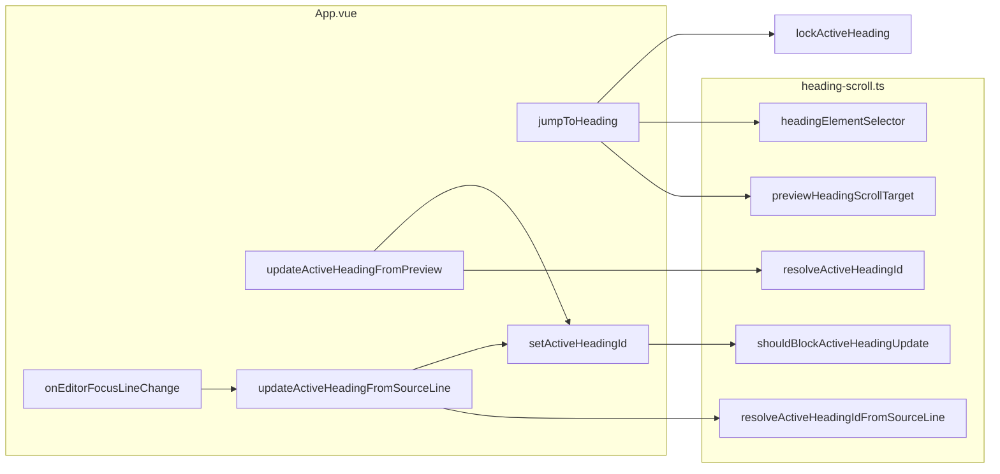
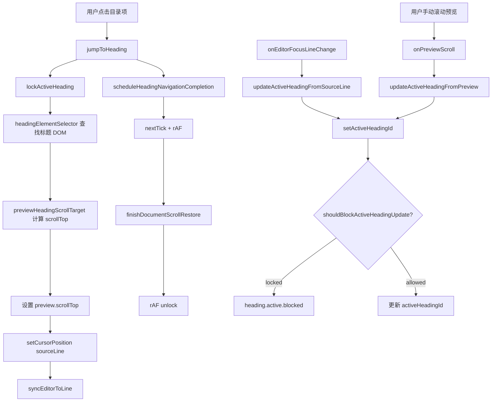
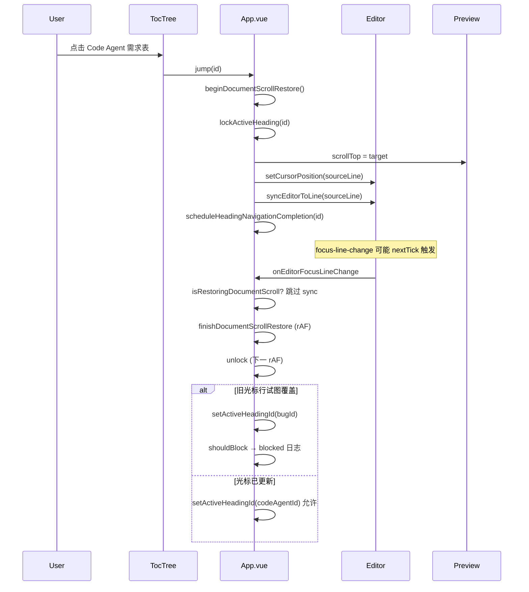
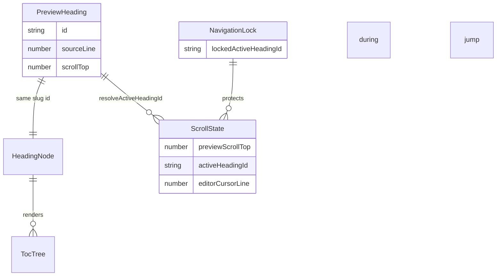
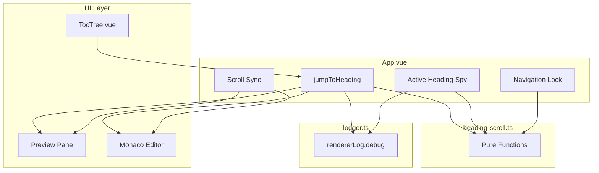

# 目录跳转与高亮偏移问题

## 问题

点击目录中的某个标题时，预览区滚动位置和高亮项可能不一致，表现为「始终差了一点」或「高亮到了上一个标题」。

典型复现场景：

| 场景 | 表现 |
| --- | --- |
| 相邻标题间距较小 | 点击 `3Top:`，高亮/滚动落到 `SpaceBuilder:` |
| 光标未随目录跳转更新 | 点击 `Code Agent 需求表`，**预览滚动正确**，目录却高亮 `Bug 表` |
| slug 以数字开头 | 点击 `3top` 类标题时，跳转可能完全失败 |

第 2 种场景具有**概率性**：预览已滚到目标位置，但异步的编辑器焦点/光标事件仍携带旧行号，把 `activeHeadingId` 写回上一项。

## 影响

- 目录导航不可信，用户无法通过 TOC 精确定位章节
- 预览滚动与目录高亮不一致，阅读和编辑时的上下文判断出错
- 以数字开头的标题 slug 在部分环境下无法完成跳转
- 问题间歇出现时难以复现，排查成本高

## 根因

### 阶段一（已修复）：Scroll Spy 区间过大

旧实现用 `getBoundingClientRect()` 配合 `activationOffset = min(240, max(32, clientHeight * 0.35))`。相邻标题落在大区间内时，`.at(-1)` 会稳定选中下一项。

### 阶段二（已修复）：目录跳转后滚动 sync 回写

`jumpToHeading()` 设置 `preview.scrollTop` 后触发 `onPreviewScroll`，经 `previewScrollOffset (-50)` 反推行号再 sync 回预览，可能拉偏位置。已通过 `beginDocumentScrollRestore()` 包裹跳转过程缓解。

### 阶段三（本次修复）：光标未迁移 + 异步高亮覆盖

`jumpToHeading()` 旧逻辑只调用 `syncEditorToLine()` **滚动编辑器**，**不移动光标**。

后续时序：

```text
1. jumpToHeading → preview 滚到 Code Agent，activeHeadingId = code-agent
2. finishDocumentScrollRestore → 恢复 scroll / focus 事件
3. onEditorFocusLineChange（nextTick）→ getCursorPosition 仍在 Bug 表行
4. updateActiveHeadingFromSourceLine(bugLine) → activeHeadingId 被改回 bug
5. syncPreviewToLine 可能因 editor 隐藏或 scrollSyncSource 被阻塞而未改 preview
   → 用户看到：滚动正确，高亮错误
```

### 附加根因：数字开头 ID 的 CSS 选择器无效

`#3top` 在 CSS 中非法，已改为 `[id="..."]`。

## 核心思路

1. **纯函数模块** `heading-scroll.ts`：滚动目标、scroll spy、源码行 spy、导航锁、标题选择器。
2. **Scroll Spy** 基于 `scrollTop + 16px`，不用大视口 band。
3. **目录跳转** 同时：`preview.scrollTop` + `setCursorPosition(sourceLine)` + `syncEditorToLine`。
4. **导航锁** `lockedActiveHeadingId`：跳转后短暂阻止其他来源把高亮降级到上一项。
5. **延迟恢复** `scheduleHeadingNavigationCompletion`：`nextTick → rAF → finishDocumentScrollRestore → rAF → unlock`。
6. **调试日志** `rendererLog.debug`：`heading.navigation.lock/unlock`、`heading.active.blocked/update`。

## 关键文件

| 文件 | 职责 |
| --- | --- |
| `src/renderer/lib/heading-scroll.ts` | 纯函数：滚动目标、spy 判定、导航锁规则、源码行 spy、标题选择器 |
| `src/renderer/App.vue` | `jumpToHeading`、锁、`setActiveHeadingId`、滚动 sync 编排 |
| `src/renderer/lib/logger.ts` | `rendererLog.debug` 输出结构化日志 |
| `tests/heading-scroll.test.ts` | 单元测试：相邻标题、边界、锁、源码行 spy |
| `tests/App.test.ts` | 集成测试：相邻标题跳转、光标竞态 |

## 设计



### 激活标题算法（预览滚动）

```text
输入: headings[{ id, top }], scrollTop, padding=16
按 top 排序（同 top 保留 DOM 顺序）
active = 第一个标题
for each heading:
  if heading.top <= scrollTop + padding:
    active = heading.id
  else:
    break
返回 active
```

### 导航锁规则

```text
lockedId 非空 且 nextId !== lockedId → 拒绝更新（打 debug 日志）
否则 → 允许更新
```

## 数据流



## 调用时序



## 数据关系



## 架构



## 使用方法

修复对用户透明，无需额外操作：

1. 打开含相邻标题的 Markdown 文档
2. 点击左侧目录任意项
3. 预览区应滚到对应标题，目录高亮与点击项一致
4. 手动滚动预览时，高亮在标题顶边越过距顶部 `16px` 激活线后切换到下一项

### 排查日志

开发时在 DevTools Console 过滤 `[markdown-editor] heading`：

| 事件 | 含义 |
| --- | --- |
| `heading.navigation.lock` | 目录跳转开始，锁定目标 id |
| `heading.navigation.unlock` | 导航完成，解除锁定 |
| `heading.active.blocked` | 拦截了一次错误的高亮覆盖（含 lockedId / attemptedId / source） |
| `heading.active.update` | 高亮正常切换（含 from / to / source） |

## 验证

```bash
pnpm test
pnpm exec vue-tsc --noEmit
```

覆盖点：

- `tests/heading-scroll.test.ts`：相邻标题、激活边界、数字 ID 选择器、导航锁、源码行 spy
- `tests/App.test.ts`：`3Top:` 跳转、光标竞态下高亮不被覆盖

## Review 记录（3 轮）

### 第 1 轮

- 确认「滚动对、高亮错」是光标未迁移 + `updateActiveHeadingFromSourceLine` 异步覆盖，不是 scroll spy 单独问题。
- 导航锁 + `setCursorPosition` 为必要改动，范围可控。
- 结论：方向正确，继续补充测试。

### 第 2 轮

- `previewScrollOffset (-50)` 与 `PREVIEW_HEADING_SCROLL_PADDING (16)` 职责分离：前者行级 sync，后者标题 spy/跳转，不强行统一。
- `setActiveHeadingId` 统一所有高亮写入，避免遗漏路径；`watch(headingTree)` 清空逻辑仍直接写 ref，可接受（仅 id 失效时）。
- 书签/光标历史跳转已先 `setCursorPosition` 再更新高亮，无需额外锁。
- 结论：无过度设计，保留双 rAF unlock。

### 第 3 轮

- 边界：锁定期约 2 帧（~32ms），期间用户极速手动滚动可能短暂延迟 spy 更新，可接受。
- 竞态：无重复 API 请求；锁为内存态，无 cache 过期问题。
- 跨平台：`setCursorPosition` / `[id="..."]` / rAF 在 macOS / Windows Electron 一致。
- 测试：集成测试模拟 stale cursor + focus 事件；单元测试覆盖 lock 与 source line spy。
- 遗漏：`onEditorScroll` 仍直接走 `updateActiveHeadingFromPreview`，跳转期间因 `isRestoringDocumentScroll` 已屏蔽，无额外风险。
- 结论：可合并，文档已同步。

## 剩余风险

- 极高密度标题（间距 < 16px）在手动滚动时切换可能偏敏感，属固定 padding 的 trade-off。
- HTML iframe 预览不走 Markdown heading spy。
- 若 Monaco `focus-line-change` 在 unlock 之后仍以极大延迟携带过期行号，理论上可能再次覆盖；可通过日志 `heading.active.blocked` 观察，必要时延长 unlock 或在校验失败时重试 `setCursorPosition`。
