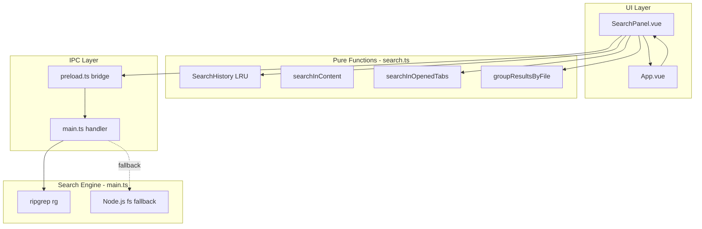
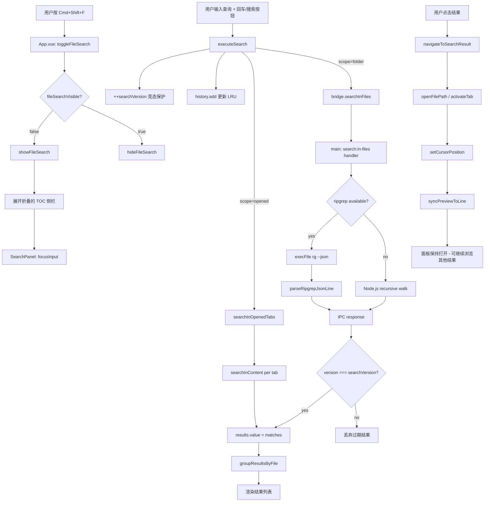
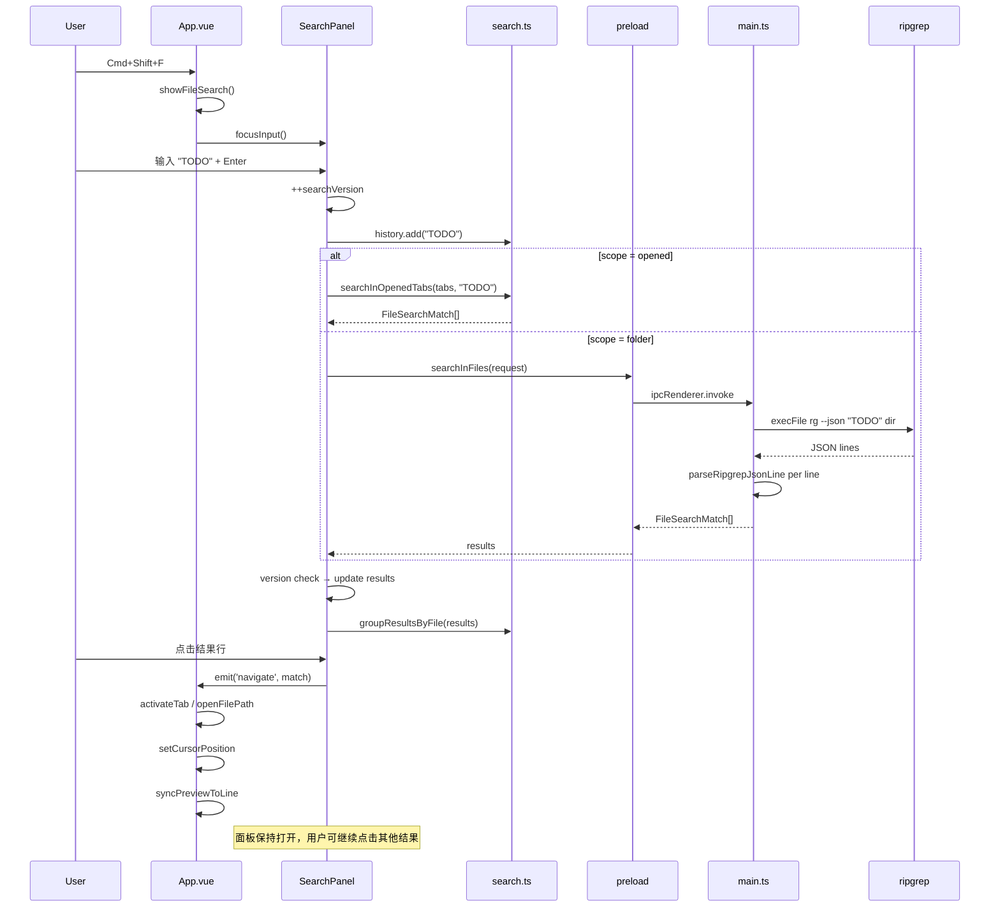
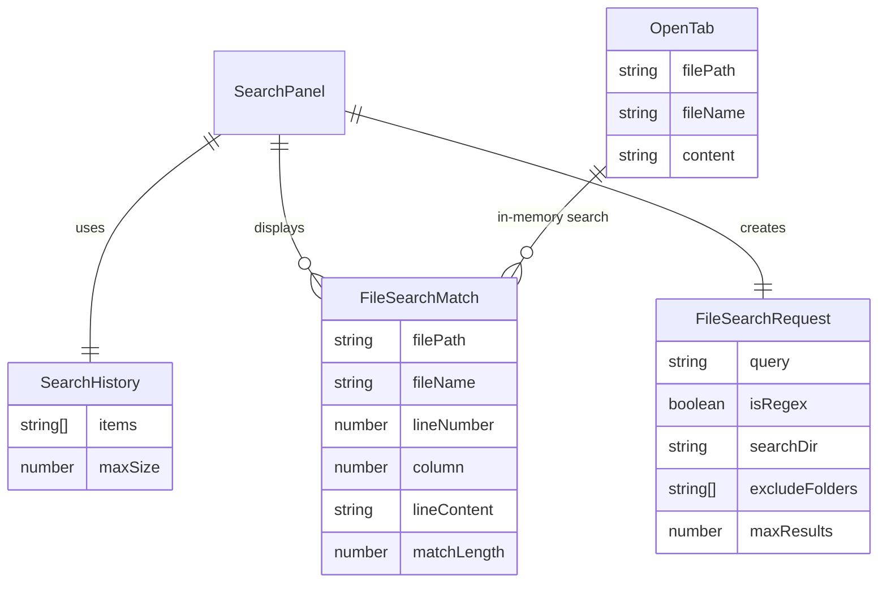

# 跨文件搜索功能

## 问题

### 第一阶段：缺少跨文件搜索

编辑器缺乏跨文件搜索能力。用户只能在当前文档内使用 `Cmd/Ctrl+F` 查找，无法：

- 在所有已打开标签页中搜索
- 在当前文件所在目录中递归搜索所有文本文件
- 使用正则表达式进行高级搜索
- 管理搜索历史

### 第二阶段：搜索面板交互体验差

搜索面板采用模态框（modal dialog）设计，存在两个核心问题：

1. **搜索状态丢失**：搜索后点击结果导航到文件，关闭模态框后再次打开，之前的搜索内容和结果全部丢失，无法在多个搜索结果之间切换
2. **交互不自然**：打开搜索 → 关闭模态框 → 查看文件内容 → 再次打开搜索 → 重新输入查询的工作流过于繁琐，不符合主流编辑器（VS Code、Sublime Text）的交互范式

## 影响

- 用户在多文件工作流中无法快速定位内容
- 缺少市面主流编辑器（VS Code、Sublime Text）的核心功能
- 大量文件场景下只能逐个打开文件搜索，效率极低
- 搜索结果无法保持，每次查看完一个结果后需要重新搜索才能查看下一个结果

## 核心思路

1. **分层设计**：纯函数层（`search.ts`）→ IPC 层（`main.ts` + `preload.ts`）→ UI 层（`SearchPanel.vue`）→ 集成层（`App.vue`）
2. **搜索引擎**：优先使用 ripgrep（`rg`），性能远超 `grep`；不可用时自动降级为 Node.js 递归 `fs.readFile`
3. **双搜索范围**：已打开文件（渲染进程内存搜索，零 IPC 开销）和当前文件夹（主进程文件系统搜索）
4. **竞态安全**：通过 `searchVersion` 递增标记，只采纳最新版本的搜索结果
5. **LRU 搜索历史**：最多保留 20 条记录，自动去重和提升最近使用项
6. **侧栏嵌入式面板**（v2）：搜索面板嵌入 TOC 侧栏区域（`v-show` 切换），替代模态框，搜索与编辑器同屏共存；面板始终保持挂载，搜索状态（query、results、history）持久化；点击结果导航时面板不关闭，用户可自由浏览多个结果

## 关键文件

| 文件 | 职责 |
| --- | --- |
| `src/renderer/lib/search.ts` | 纯函数：类型定义、LRU 历史、`searchInContent`、`searchInOpenedTabs`、`groupResultsByFile`、`truncateLineContent` |
| `src/renderer/components/SearchPanel.vue` | 搜索面板 UI（侧栏嵌入式）：输入框、正则切换、范围选择、排除过滤、历史下拉、结果列表 |
| `electron/main.ts` | IPC handler `search:in-files`：ripgrep 优先 → Node.js fallback；菜单项「在文件中搜索」 |
| `electron/preload.ts` | Bridge 方法 `searchInFiles` 暴露给渲染进程 |
| `src/renderer/env.d.ts` | `FileSearchRequest`/`FileSearchMatch` 类型、`AppMenuCommand` 扩展 |
| `src/renderer/App.vue` | 集成：状态管理、`v-show` 切换搜索/TOC、菜单/快捷键 toggle、结果导航（打开文件 + 滚动到行，面板不关闭） |
| `src/renderer/styles.less` | 搜索面板样式（`.file-search-panel` 侧栏嵌入、`.toc-content` 包裹层） |
| `tests/search.test.ts` | 纯函数单元测试：LRU、正则构建、内容搜索、分组、截断 |
| `tests/App.test.ts` | 集成测试：面板打开/关闭/toggle、搜索执行、范围切换、正则切换、空结果、导航后面板保持、状态持久化 |

## 设计



### 搜索引擎选择策略

```text
1. findRipgrepPath() 检测系统是否安装 rg（结果缓存）
2. searchWithRipgrep() 使用 --json 输出 + --fixed-strings/regex
3. 若 rg 不可用或启动失败 → searchWithNodeFs() 递归遍历
4. 默认排除: node_modules, .git, dist, build, .next, __pycache__, .DS_Store
5. 用户可额外排除 0~N 个文件夹（逗号分隔）
```

### LRU 搜索历史

```text
容量: 20
操作: add(query) → 去重 → 插入头部 → 超容量淘汰末尾
      remove(query) → 删除指定项
      getAll() → 返回快照副本
UI: 输入框聚焦时显示下拉，点击选中，x 按钮删除
```

## 数据流



## 调用时序



## 数据关系



## 架构

```mermaid
flowchart TB
  subgraph renderer [Renderer Process]
    subgraph ui [UI Components]
      App[App.vue orchestration]
      Panel[SearchPanel.vue]
    end

    subgraph lib [Pure Functions]
      SearchLib[search.ts]
      Logger[logger.ts]
    end
  end

  subgraph preload [Preload Bridge]
    BridgeAPI[markdownBridge.searchInFiles]
  end

  subgraph main [Main Process]
    IPC[IPC Handler search:in-files]
    subgraph engines [Search Engines]
      Ripgrep[ripgrep - primary]
      NodeFS[Node.js fs - fallback]
    end
  end

  subgraph os [Operating System]
    FS[File System]
    RGBin[/usr/local/bin/rg]
  end

  App --> Panel
  Panel --> SearchLib
  Panel --> Logger
  Panel --> BridgeAPI
  BridgeAPI --> IPC
  IPC --> Ripgrep
  IPC -.-> NodeFS
  Ripgrep --> RGBin
  RGBin --> FS
  NodeFS --> FS
```

## 使用方法

### 打开搜索面板

- **快捷键**: `Cmd+Shift+F` (macOS) / `Ctrl+Shift+F` (Windows)
- **菜单**: 编辑 → 在文件中搜索...
- **菜单命令**: `show-file-search`

### 搜索操作

1. 输入搜索关键词
2. 可选：点击 `.*` 切换正则表达式模式
3. 选择搜索范围：「已打开文件」或「当前文件夹」
4. 可选：在「当前文件夹」模式下输入排除文件夹（逗号分隔，如 `node_modules,dist`）
5. 按 Enter 或点击「搜索」按钮
6. 点击任意结果行，编辑器会打开对应文件并跳转到匹配位置
7. 搜索面板保持打开，可继续点击其他结果在文件间切换
8. 关闭搜索面板后再次打开，搜索内容和结果仍保持，无需重新搜索
9. 按 Escape 或再次按 `Cmd+Shift+F` 可关闭搜索面板，返回 TOC 目录

### 搜索历史

- 输入框聚焦时自动显示历史下拉（如有）
- 点击历史项直接执行搜索
- 点击 `x` 删除单条历史
- 历史容量：最多 20 条，LRU 策略

### 排查日志

在 DevTools Console 过滤 `[markdown-editor] search`：

| 事件 | 含义 |
| --- | --- |
| `search.execute` | 搜索触发（含 query、scope、isRegex） |
| `search.openedTabs.complete` | 已打开文件搜索完成（含 tabCount、resultCount） |
| `search.ripgrep.detect` | ripgrep 路径检测结果 |
| `search.ripgrep.start` | ripgrep 搜索开始（含参数） |
| `search.ripgrep.complete` | ripgrep 搜索完成（含 resultCount） |
| `search.ripgrep.fallback` | ripgrep 不可用，降级到 Node.js |
| `search.node-fs.start` | Node.js 文件遍历搜索开始 |
| `search.node-fs.complete` | Node.js 搜索完成 |
| `search.navigate` | 用户导航到搜索结果 |
| `search.history.add` | 搜索历史更新 |
| `search.regex.invalid` | 无效正则表达式 |

## 验证

```bash
pnpm test
pnpm exec vue-tsc --noEmit
```

覆盖点：

- `tests/search.test.ts`（32 用例）：LRU 增删查清容量、正则转义/构建/无效处理、内容搜索（大小写、多匹配同行、maxResults、空内容、零长匹配）、跨 Tab 搜索、结果分组、行截断
- `tests/App.test.ts`（8 新用例）：面板打开/关闭/Escape关闭、toggle 切换、搜索执行、空结果状态、范围切换、正则切换、Cmd+Shift+F 快捷键、导航后面板保持打开并保留结果

## Review 记录（3 轮）

### 第 1 轮

- `historyItems` computed 使用非 reactive 的 `SearchHistory` 实例 → 引入 `historyVersion` ref 作为响应式触发器
- `activeResultIndex` 定义但未使用 → 移除
- `v-for="(match, idx)"` 中 `idx` 未使用 → 改为 `v-for="match"`
- `showHistory` 在 `focusInput` 中应重置 → 已修复

### 第 2 轮

- ripgrep exit code 1 表示「未找到匹配」不是错误 → 修改错误处理逻辑只在非 1 exit code 时 reject
- `child.on('error')` 与 `execFile` callback 双触发风险 → 移除独立的 error handler，统一在 callback 处理
- `--glob '!folder'` 缺少 `/` 后缀 → 改为 `!folder/` 明确排除目录
- `ChildProcess` 类型 import 不再使用 → 移除
- 测试 mock 缺少 `searchInFiles` → 已补充

### 第 3 轮

- 历史下拉在输入框失焦后应关闭 → 添加 `@blur` handler（200ms 延迟以允许点击历史项）
- 缺少空结果状态和范围切换的测试 → 已补充 2 个新测试用例
- 竞态确认：`searchVersion` 递增 + 版本校验确保只采纳最新结果
- 跨平台确认：`fileSearchDir` 同时处理 `/` 和 `\` 分隔符；ripgrep 检测使用 `which`（macOS）/ `where`（Windows）

### 第 4 轮（v2：侧栏面板重构）

**问题**：模态框设计导致搜索状态丢失，交互不自然

**方案**：侧栏嵌入式面板 — 搜索面板嵌入 TOC 区域，使用 `v-show` 切换

**关键改动**：

- `App.vue`：SearchPanel 从模态框移入 `<aside class="toc-panel">` 内部，用 `v-show` 替代 `v-if` 保持组件挂载
- `App.vue`：新增 `toggleFileSearch()`，菜单和快捷键改为 toggle 行为
- `App.vue`：`showFileSearch()` 展开折叠的 TOC 侧栏避免不可见
- `App.vue`：`navigateToSearchResult()` 不再关闭面板
- `App.vue`：`onKeyDown` 添加 `fileSearchVisible` 的 Escape 处理
- `SearchPanel.vue`：组件根元素从 `.file-search-dialog` 改为 `.file-search-panel`
- `SearchPanel.vue`：Escape 只关闭历史下拉，外层 Escape 由 App.vue 统一处理
- `styles.less`：删除 `.file-search-modal`，`.file-search-dialog` 改为 `.file-search-panel`（侧栏嵌入布局）
- `styles.less`：`.toc-panel` 改用 `display: grid` + `overflow: hidden`，新增 `.toc-content` 包裹 TOC 内容
- `tests/App.test.ts`：更新 testid `file-search-modal` → `file-search-panel`，断言用 `style` 检测代替 `isVisible()`，新增 toggle 和结果持久化测试

**审查确认**：
- 竞态安全：`searchVersion` 机制未受影响
- 状态持久化：`v-show` 保持组件实例，搜索状态（query、results、history）在关闭/重开间保留
- 无 DOM 泄漏：`v-show` 仅切换 display，不频繁创建/销毁组件
- 跨平台：改动仅涉及 CSS 和 Vue 模板逻辑，无 OS API 依赖

## 剩余风险

- ripgrep 未安装的环境中，Node.js fallback 对于大目录树（>10k 文件）可能较慢，但有 `maxResults` 和 `searchMaxFileSize` 限制
- 搜索历史保存在组件实例内存中，应用退出后丢失（设计选择：避免 session 膨胀）
- 二进制文件通过扩展名白名单过滤，未识别的文本格式（如无扩展名）在 Node.js fallback 中不会被搜索，但 ripgrep 会自动跳过二进制文件
