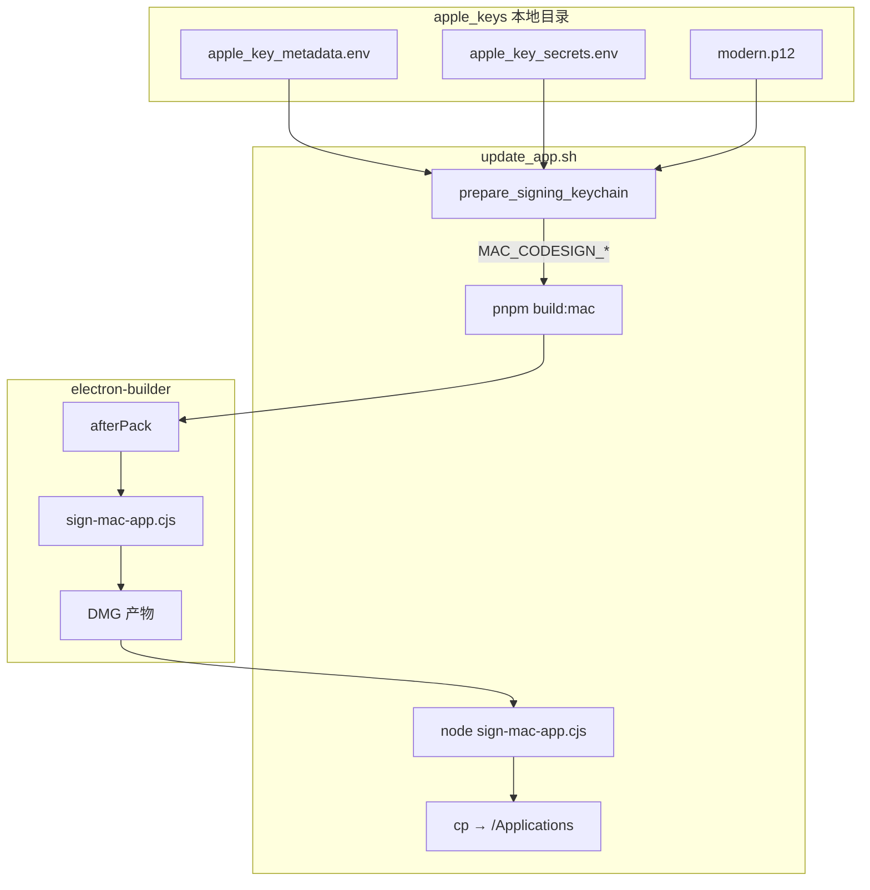
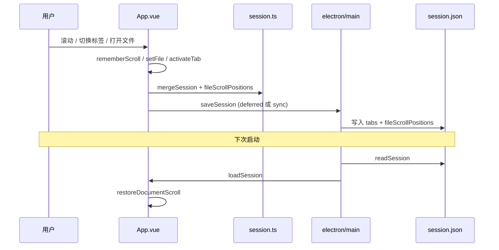
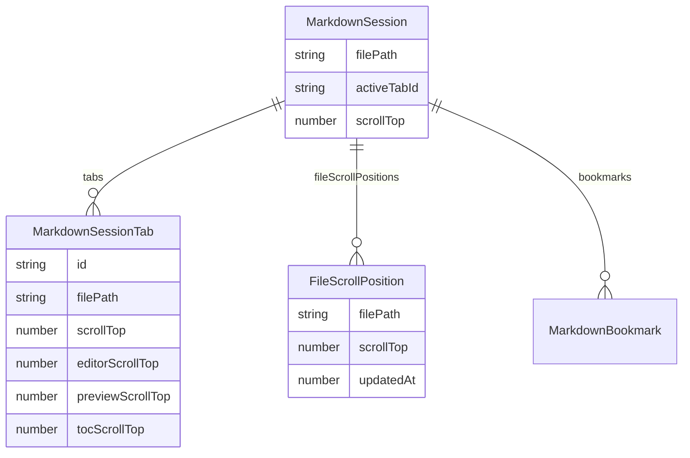

# Markdown 纪：本地签名更新与发布

记录时间：2026-06-03

## 问题

1. **构建阶段签名失败**：运行 `./update_app.sh` 时，`electron-builder` 的 `afterPack` 会在打包过程中立即调用 `codesign`。若此时签名 keychain 未解锁、证书未导入、或未设置 `set-key-partition-list`，非交互环境常报 `errSecInternalComponent`（例如 `libEGL.dylib: replacing existing signature` 之后失败）。
2. **滚动位置无法跨会话恢复**：关闭文件或切换标签后再打开，编辑器 / 预览 / 目录的滚动位置丢失，影响长文档阅读连续性。

## 影响

| 场景 | 影响 |
|------|------|
| 本地 `./update_app.sh` 失败 | 无法把已签名构建安装到 `/Applications`，开发迭代受阻 |
| Gatekeeper / 分发 | 未公证时其他机器首次打开需额外步骤；`--sign` 路径可完成公证与 staple |
| 用户体验 | 重新打开同一文件时回到文首，书签与最近文件列表无法弥补垂直滚动记忆 |

## 解决思路

### A. 签名与本地更新（`update_app.sh`）

在 `pnpm build:mac` **之前** 内联 `apple_keys/import_into_keychain.sh` 同等逻辑（`prepare_signing_keychain`）：

1. 读取 `apple_key_metadata.env` / `apple_key_secrets.env`（默认目录 `/Users/hunter/Workspace/apple_keys`）。
2. 使用专用 keychain `~/Library/Keychains/apple-build-signing.keychain-db`（可用 `MAC_CODESIGN_KEYCHAIN` 覆盖）。
3. 按**文件是否存在**判断 keychain（不用 `show-keychain-info`，避免锁定状态误判）。
4. 解锁、设置超时、加入 user search list、按需导入 `developer_id_application_pine_field_modern.p12`。
5. 刷新 `set-key-partition-list`，确认 `Developer ID Application: Pine Field Inc (Y8JR7FG9SR)` 可用。
6. 导出 `MAC_CODESIGN_*` 后执行 `pnpm build:mac` → `afterPack` 签名 → 可选二次 `sign-mac-app.cjs` → 复制到 `/Applications` 并 `open`。

默认**不**公证；需要 Gatekeeper「Notarized Developer ID」时加 `--sign`。

### B. 滚动位置持久化（0.1.8 功能）

- **按标签页**：`tabs[]` 增加 `editorScrollTop`、`previewScrollTop`、`tocScrollTop`（兼容旧 `scrollTop`）。
- **按文件路径**：`fileScrollPositions[]`（最多 20 条，与 `recentFiles` 同路径规范化规则），在 `setFile` / `rememberScroll` / `activateTab` 时更新。
- **外部打开**（Finder / 命令行传入）：`options.external` 时强制滚动归零，不套用历史位置。
- **保存**：`rememberScroll` 走 `persistTabSession` 的 `deferred` 防抖，避免滚动事件风暴写盘。

## 关键文件

| 文件 | 职责 |
|------|------|
| `update_app.sh` | keychain 准备、构建、签名、安装、重启应用 |
| `scripts/after-pack.cjs` | macOS `afterPack`：Info.plist 清理、调用 `sign-mac-app.cjs` |
| `scripts/sign-mac-app.cjs` | 深度 `codesign`（Framework / Helper / 主包） |
| `scripts/notarize-mac-app.cjs` | zip → notarytool → staple → `spctl` |
| `build/entitlements.mac.plist` | Hardened Runtime 权限 |
| `src/renderer/lib/session.ts` | 会话规范化、`fileScrollPositions` CRUD |
| `electron/main.ts` | 主进程读写 `session.json`（与 renderer 字段对齐） |
| `src/renderer/App.vue` | 滚动记忆、恢复、`setFile` / `activateTab` 编排 |
| `tests/session.test.ts` / `tests/App.test.ts` | 滚动与持久化行为 |
| `tests/electron-config.test.ts` | 构建/更新脚本契约 |

签名材料（**勿提交 git**）：

```text
/Users/hunter/Workspace/apple_keys/
  apple_key_metadata.env
  apple_key_secrets.env
  developer_id_application_pine_field_modern.p12
  AuthKey_*.p8
```

## 架构与数据流







## 使用方法

### 本地自签名更新（不公证）

```bash
cd /Users/hunter/Workspace/markdown_editor
./update_app.sh
```

### 签名 + 公证 + staple + Gatekeeper 校验

```bash
./update_app.sh --sign
```

### 自定义签名材料目录

```bash
APPLE_KEYS_DIR=/path/to/apple_keys ./update_app.sh
```

### 仅构建发布产物

```bash
# 需先保证 keychain 已准备（可单独执行 apple_keys/import_into_keychain.sh）
source /Users/hunter/Workspace/apple_keys/apple_key_metadata.env
source /Users/hunter/Workspace/apple_keys/apple_key_secrets.env
export MAC_CODESIGN_IDENTITY="$APPLE_CERTIFICATE_ID"
export MAC_CODESIGN_KEYCHAIN="$HOME/Library/Keychains/apple-build-signing.keychain-db"

pnpm build:mac      # release/Markdown 纪-<version>-arm64.dmg
pnpm build:win_x64  # release/Markdown 纪-<version>-win-x64-setup.exe
```

### GitHub Release（示例）

```bash
pnpm test && pnpm lint
# 构建并重命名为 updater 友好文件名后：
gh release create v0.1.8 \
  --title "Markdown 纪 0.1.8" \
  release/markdown-editor-0.1.8.dmg \
  release/markdown-editor-setup-0.1.8.exe \
  ...
```

## 跨平台说明

| 平台 | 构建 | 签名 |
|------|------|------|
| macOS arm64 | `pnpm build:mac`，`update_app.sh` 仅支持 arm64 主机 | Developer ID + 可选 notary |
| Windows x64 | `pnpm build:win_x64`（macOS 上可交叉编译 NSIS） | 本机 `signtool`（无 Apple 证书时仍可产出安装包） |

滚动持久化逻辑在 renderer / main 均为纯 JSON，路径规范化对 Windows `\` 与 `file://` URL 一致处理。

## 验证清单

```bash
bash -n update_app.sh
pnpm test
pnpm lint
security find-identity -v -p codesigning ~/Library/Keychains/apple-build-signing.keychain-db
./update_app.sh   # 应输出 Updated /Applications/Markdown 纪.app
codesign --verify --deep --strict /Applications/Markdown\ 纪.app
```

## 代码审查摘要（三轮）

1. **必要性**：keychain 准备是修复 `afterPack` 签名的最小改动；滚动字段为产品需求，非附带重构。
2. **风险**：`fileScrollPositions` 与 `tabs` 可能短暂不一致（切换标签前未 `syncActiveTabState` 时以 tab 内字段为准）；外部打开故意不恢复滚动。
3. **测试**：`session.test` 覆盖 `addFileScrollPosition` / `findFileScrollPosition`；`App.test` 覆盖重开文件与标签切换恢复；`electron-config.test` 覆盖 `prepare_signing_keychain` 契约。
4. **可维护性**：会话规范化在 `session.ts` 与 `main.ts` 重复是为 IPC 边界隔离，字段保持同名；`App.vue` 仍偏大但滚动逻辑集中在 `rememberScroll` / `restoreDocumentScroll`。
5. **竞态**：滚动保存使用已有 `scheduleSessionSave` 防抖；无重复 session 读取 API。
6. **未做**：`afterPack` 与 `update_app.sh` 二次签名可合并以缩短构建时间；REST/Swagger 不适用（桌面 Electron 应用）。

## 故障排除

| 现象 | 处理 |
|------|------|
| `errSecInternalComponent` | 运行 `apple_keys/import_into_keychain.sh` 或检查 partition list / keychain 密码 |
| 找不到签名身份 | 确认 `MODERN_P12` 路径与 `APPLE_CERTIFICATE_ID` |
| 构建产物名含中文 | DMG 默认为 `Markdown 纪-<version>-arm64.dmg`；发布时可复制为 `markdown-editor-<version>.dmg` 以匹配 `latest-mac.yml` |
| 仅 Intel Mac | 当前 `update_app.sh` 固定 arm64；需改 `build:mac` arch 与脚本 `uname` 分支 |

## 相关文档

- `local_docs/improve_sign_apple.md` — `update_app.sh` keychain 修复专项记录
- `/Users/hunter/Workspace/apple_keys/sign_apple_notarize.md` — 历史公证记录与材料说明
- `docs/Mac_Distribution.md` — 分发与 entitlements 说明
