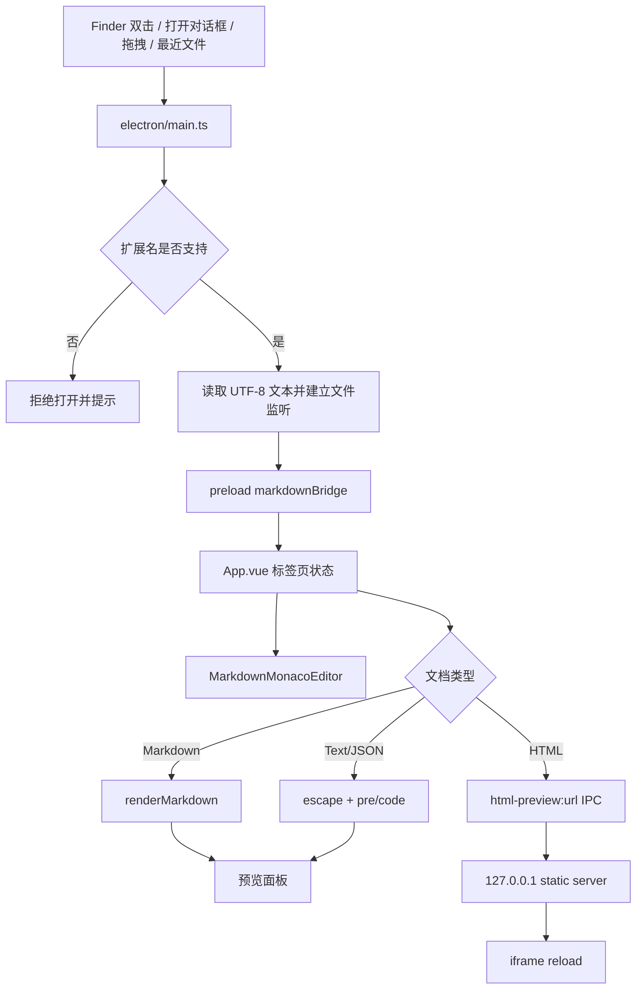
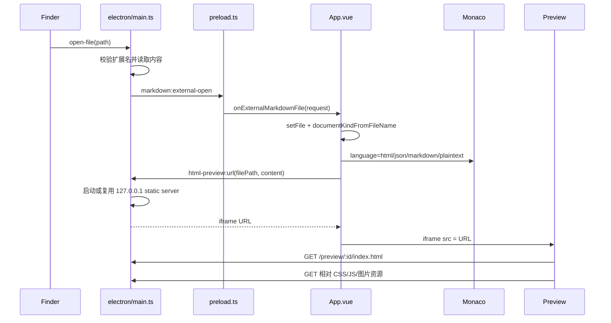
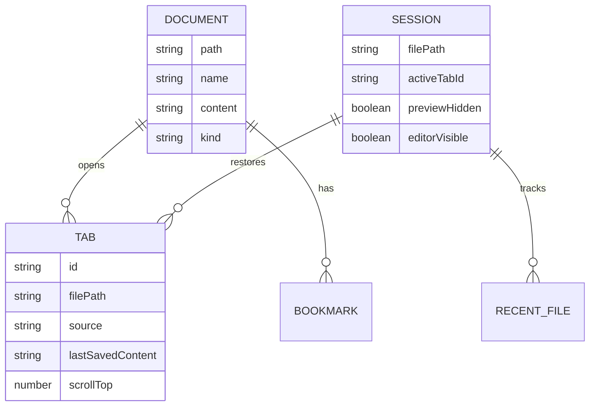
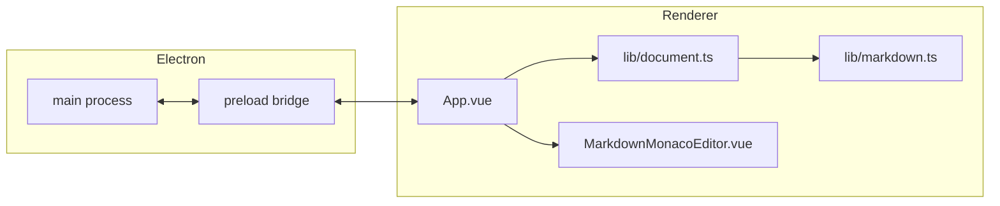

# 支持 HTML、Text、JSON 文档

## 关键文件

- `electron/main.ts`: 主进程文件打开、保存、Finder/系统文件关联启动、文件监听、菜单命令、HTML 预览 static server。
- `electron/preload.ts`: 维持现有 `markdownBridge` IPC 桥接，接口名保持兼容，实际可传输支持文档。
- `src/renderer/App.vue`: 文档类型识别、预览切换、JSON 格式化/单行化、标签页、最近文件、保存和快捷键。
- `src/renderer/components/MarkdownMonacoEditor.vue`: Monaco 编辑器语言模式，由当前文档类型决定。
- `src/renderer/lib/document.ts`: 支持扩展名、文档类型、预览渲染、HTML 预览清理、JSON 格式化。
- `package.json`: macOS 和 Windows 打包文件关联，包含 Markdown、HTML、Text、JSON。

## 设计

应用保留原有 Markdown IPC 命名以减少改动面，但主进程和渲染进程内部把可打开文件扩展为“支持文档”：

- Markdown: `.md`, `.markdown`, `.mdown`
- HTML: `.html`, `.htm`
- Text: `.txt`, `.text`
- JSON: `.json`

Markdown 继续使用 `markdown-it` 渲染并支持 Mermaid、标题目录、图片资源等能力。HTML 使用 iframe 预览，主进程启动只监听 `127.0.0.1` 的 static server：`/preview/:id/index.html` 返回当前编辑器内容，同一路径下的 CSS、JS、图片等资源按 HTML 文件所在目录解析。Text 和 JSON 使用转义后的 `<pre><code>` 预览，避免把内容解释成 HTML。

JSON 增加两个编辑操作：

- 格式化: `JSON.stringify(JSON.parse(source), null, 2)`
- 单行化: `JSON.stringify(JSON.parse(source))`

解析失败时不修改原文，并在状态栏提示 JSON 不合法。

## 数据流动

## 调用时序

## 数据关系

## 架构

## 使用方法

1. 使用打开按钮、拖拽文件、最近文件，或在 Finder 中把 `.html`、`.txt`、`.text`、`.json` 绑定到应用后双击打开。
2. HTML 文件会显示源码编辑和 iframe 实时预览；编辑后会自动 reload iframe。
3. Text 文件会显示源码编辑和纯文本预览。
4. JSON 文件会显示源码编辑和纯文本预览；工具栏会出现格式化 JSON 和 JSON 转单行按钮。
5. 保存、另存为、全部保存、标签页、最近文件、搜索替换、书签、阅读/编辑切换等基础流程沿用 Markdown 的实现。

## 兼容性说明

- 文件路径处理使用 Electron/Node `path`、`fileURLToPath` 和 `shell.showItemInFolder`，兼容 macOS 与 Windows 路径分隔符。
- HTML 预览服务器只绑定 `127.0.0.1`，资源路径通过 `path.resolve` 限制在当前 HTML 文件目录内，避免跨目录读取。
- 文件关联写在 electron-builder `mac.fileAssociations` 和 `win.fileAssociations`，用于 macOS Finder 与 Windows 安装后的文件打开入口。
- 文本读写统一使用 UTF-8。
